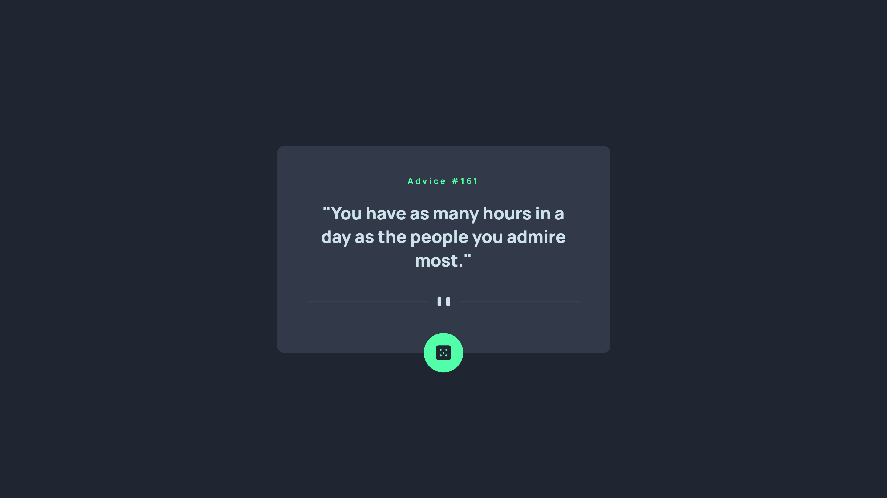

# Frontend Mentor - Advice generator app solution

This is a solution to the [Advice generator app challenge on Frontend Mentor](https://www.frontendmentor.io/challenges/advice-generator-app-QdUG-13db). Frontend Mentor challenges help you improve your coding skills by building realistic projects.

## Table of contents

- [Overview](#overview)
  - [The challenge](#the-challenge)
  - [Screenshot](#screenshot)
- [My process](#my-process)
  - [Built with](#built-with)
  - [What I learned](#what-i-learned)
  - [Continued development](#continued-development)
- [Author](#author)

## Overview

### The challenge

Users should be able to:

- View the optimal layout for the app depending on their device's screen size
- See hover states for all interactive elements on the page
- Generate a new piece of advice by clicking the dice icon

### Screenshot

### Links

- Solution URL: (https://github.com/peterbujaky/advice-generator-app)
- Live Site URL: (https://your-live-site-url.com)

## My process

### Built with

- Semantic HTML5 markup
- SASS
- Flexbox
- Javascript
- Mobile-first workflow

### What I learned

During this project I have learned how to use fetch API and convert the data into JSON, grab the data and sore it in variables and manipulate the DOM accordingly to the project's specifications

### Continued development

This was a good first project to get familiar albeit beint rather simple I will focus on completing similar but more complex projects.

## Author
- Frontend Mentor - [@peterbujaky](https://www.frontendmentor.io/profile/peterbujaky)
